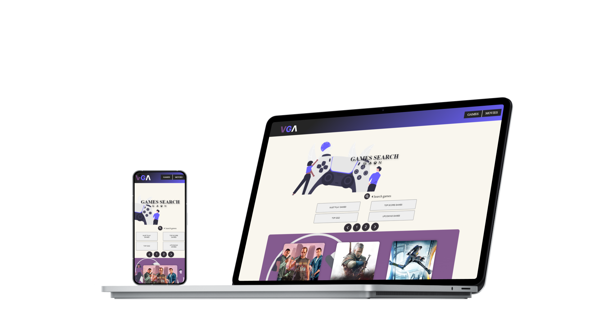

# VGA - video game archives

A webpage using apis to search for games and movies

## APIS
using rawg.io and themoviedb api
- [RAWG][rawg]
- [The movie db][themoviedb]

## __Preview__

 &nbsp; &nbsp;

# __Languages and Tools:__
[][vscode]
[][html]
[][css]
[][javascript]
 

## Project tech
Using only html, css and js no frameworks

## Demo on surge

If you want to try it out you can either get your own keys 
or contact me and I'll send you a demo link

## __My Socials__

- Github - [robonexx](https://github.com/xxrobone)
- Linkedin - [Robert Wägar](https://www.linkedin.com/in/robert-w%C3%A4gar-1b4661139/)
- Portfolio - "In the works"

 

[vscode]: https://code.visualstudio.com/
[javascript]: https://developer.mozilla.org/en-US/docs/Web/JavaScript
[html]: https://www.w3schools.com/html/
[css]: https://www.w3.org/Style/CSS/Overview.en.html

[rawg]: https://rawg.io/apidocs
[themoviedb]: https://www.themoviedb.org/documentation/api